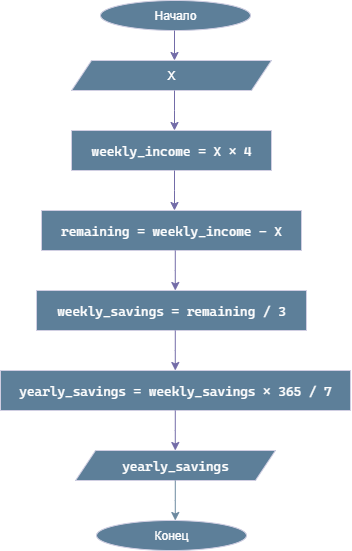

# Домашнее задание к работе 2

## Условие задачи
Каждую неделю Юра получает деньги на мелкие расходы. Из них он тратит **X** рублей на сладости. Это составляет одну четверть того, что он получает еженедельно. Юра сберегает одну треть того, что остается после покупки сладостей. Составьте программу, которая выведет на экран сумму, накопленную Юрой за год.

## 1. Алгоритм и блок-схема

### Алгоритм
1. **Начало**
2. Задать исходные данные:
   - `x` — сумма, которую Юра тратит на сладости в неделю (руб.).
3. Вычислить еженедельный доход:
   - `weekly_income` = `x` × 4
4. Вычислить остаток после покупки сладостей:
   - `remaining_after_sweets` = `weekly_income` - `x`
5. Вычислить еженедельные сбережения:
   - `weekly_savings` = `remaining_after_sweets` / 3
6. Вычислить годовые накопления:
   - `yearly_savings` = `weekly_savings` * 365 / 7
7. Вывести результаты расчетов с подробными пояснениями и формулами.
8. **Конец**

### Блок-схема


## 2. Реализация программы

```c
#include <stdio.h>
#include <locale.h>

int main() {
    setlocale(LC_CTYPE, "");

    // Объявление и инициализация констант
    const int weeks_in_year = 365/7;     // недель в году

    // Шаг 1: Задание конкретных значений переменных
    float x = 100.0;  // Сумма на сладости в неделю (руб.)

    // Шаг 2: Расчет еженедельного дохода
    float weekly_income = x * 4;  // Сладости = 1/4 дохода

    // Шаг 3: Расчет еженедельных сбережений
    float remaining_after_sweets = weekly_income - x;  // Остаток после сладостей
    float weekly_savings = remaining_after_sweets / 3; // Сберегает 1/3 от остатка

    // Шаг 4: Расчет годовых накоплений
    float yearly_savings = weekly_savings * weeks_in_year;

    // Шаг 5: Форматированный вывод результатов
    printf("Расчет накоплений Юры за год\n");
    printf("============================\n\n");
    printf("УСЛОВИЯ:\n");
    printf("- Еженедельные траты на сладости: %.2f руб.\n", x);
    printf("- Сладости составляют 1/4 от еженедельного дохода\n");
    printf("- После покупки сладостей остается: %.2f руб.\n", remaining_after_sweets);
    printf("- Юра сберегает 1/3 от оставшейся суммы: %.2f руб. в неделю\n\n", weekly_savings);

    printf("РАСЧЕТ:\n");
    printf("- Еженедельный доход: %.2f руб. (%.2f × 4)\n", weekly_income, x);
    printf("- Остаток после сладостей: %.2f руб. (%.2f - %.2f)\n", remaining_after_sweets, weekly_income, x);
    printf("- Еженедельные сбережения: %.2f руб. (%.2f ÷ 3)\n", weekly_savings, remaining_after_sweets);
    printf("- Годовые накопления: %.2f руб. (%.2f × %d)\n", yearly_savings, weekly_savings, weeks_in_year);
    printf("============================\n");
    printf("Сумма,накопленная Юрой за год: %.2f руб.\n", yearly_savings);

    return 0;
}
```

## 3. Результаты работы программы

```
РАСЧЕТ НАКОПЛЕНИЙ ЮРЫ ЗА ГОД
============================

УСЛОВИЯ:
- Еженедельные траты на сладости: 100.00 руб.
- Сладости составляют 1/4 от еженедельного дохода
- После покупки сладостей остается: 300.00 руб.
- Юра сберегает 1/3 от оставшейся суммы: 100.00 руб. в неделю

РАСЧЕТ:
- Еженедельный доход: 400.00 руб. (100.00 × 4)
- Остаток после сладостей: 300.00 руб. (400.00 - 100.00)
- Еженедельные сбережения: 100.00 руб. (300.00 ÷ 3)
- Годовые накопления: 5200.00 руб. (100.00 × 52)
============================
СУММА, НАКОПЛЕННАЯ ЮРОЙ ЗА ГОД: 5200.00 руб.
```

## 4. Информация о разработчике

Маркина Елена, бТИИ-251
